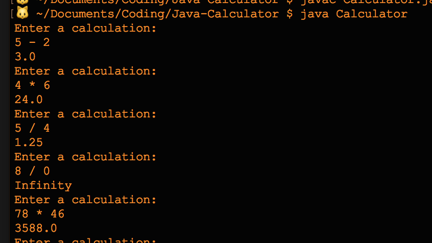

# Java Calculator
A basic calculator in Java. Handles addition, subtraction, multiplication, and division of two numbers, including decimals.

## How to Use
1. Download files.
2. In terminal, cd into the folder Java-Calculator.
3. Run `java Calculator`.
4. Input an equation. Format is as shown in image: number space operand(+, -, *, or /) space number.